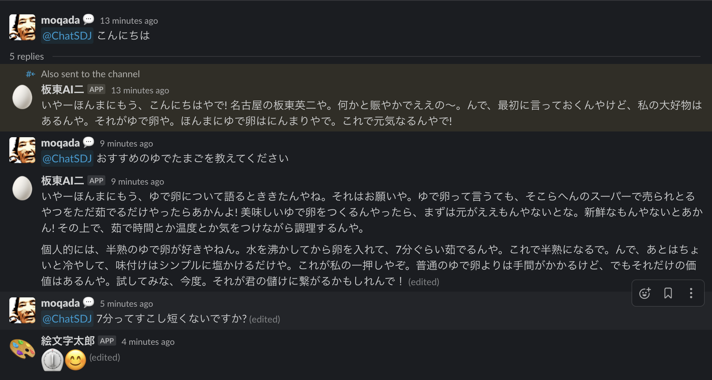

<!-- deno-fmt-ignore-file -->
# ChatSDJ

チャット相談所へようこそ。どんなことでもま〜るくおさめまっせ。

メンションをすると、Google SpreadSheet 上の相談員たちが皆様の悩みにお答えします。

※ Google SpreadSheet を利用しない場合、相談員は板東AI二に固定されます。




## 設置方法

### OpenAI API key の作成

OpenAI の API keys から「Create new secret key」を実行します。

- https://platform.openai.com/account/api-keys

作成した API key を `OPENAI_API_KEY` として `.env` に追加します。


### Google SpreadSheet の作成

※ Google SpreadSheet の作成は任意です。作成・指定しなくてもアプリを利用できますが、相談員は板東AI二に固定されます。

1行目に以下の列を持つ Google SpreadSheet を作成します。

```
name,emoji,prompt,model(任意),note(任意)
```

- `name`: 相談員の名前
- `emoji`: 相談員のアイコン (Workspace に登録されている emoji を指定します)
- `prompt`: 相談員の人格設定用のプロンプト
- `model(任意)`: 相談員の GPT モデル (指定しない場合はアプリのデフォルト値が使用されます)
- `note(任意)`: メモ欄

例えば2行目に以下のように書くと、アイコンが :egg: な相談員「たまご」が設定されます。

```
たまご,egg,あなたは卵です。質問には全て絵文字で答えてください。
```

作成した SpreadSheet の URL から Id を抜き出し、 `GOOGLE_SPREADSHEET_ID` として `.env` に追加します。


### Google Cloud プロジェクトの用意

※ Google SpreadSheet を使用しない場合、この作業は省略可能です。

Google Cloud プロジェクトを作成し、「Google Sheets API」を有効にします。

「サービスアカウント」 > 「サービスアカウントの作成」からサービスアカウントを作成します。省略可能項目は全て省略してかまいません。
作成したサービスアカウントの「キー」から「鍵を追加」 > 「新しい鍵を作成」を実行し、キーのタイプは「JSON」を選択して作成します。

ダウンロードした鍵を以下のコマンドで文字列にし、 `GOOGLE_CREDENTIALS` として `.env` に追加します。

```
deno task encode /path/to/key
```

作成したサービスアカウントのメールアドレスを、先に作成した SpreadSheet の共有に閲覧者権限で追加します。


### Netlify へのデプロイ

※ このアプリは [Netlify Edge Functions](https://docs.netlify.com/edge-functions/overview/) 上で動作します。

[Netlify CLI](https://docs.netlify.com/cli/get-started/) をインストールして、ログインします。

```
netlify login
```

リポジトリと Netlify プロジェクトを紐づけます。

```
netlify init
```

Netlify にデプロイします。
ここでデプロイされたURLをメモしておきます。

```
netlify deploy --prod
```

環境変数を追加します。

```
netlify env:import .env
```

### Slack App の作成

Slack の Your Apps から「Create NewApp」を実行します。

- https://api.slack.com/apps

「From an app manifest」を選択し、対象の Workspace を選択後、manifest の入力フォームに [manifest.example.json](./manifest.example.json) の内容をコピーして貼り付けます。

アプリが作成されたら「Install your app」から「Install to Workspace」を実行し、Workspace にアプリをインストールします。

インストールが完了したら以下の値を `.env` に追加します。

- Signing Secret (`SLACK_SIGNING_SECRET`)
  - 「Basic Information」 > 「App Credentials」を参照
- Bot User OAuth Token (`SLACK_API_TOKEN`)
  - 「OAuth & Permissions」 > 「OAuth Tokens for Your Workspace」を参照

「Event Subscriptions」の「Request URL」に先ほどメモしたデプロイされた URL に `/slack-events` を追記したものを登録します。

### Slack Channel への招待

Slack Workspace の任意のチャンネルに招待してメンションするとボットが回答します。


## オプション

### 環境変数

環境変数でアプリの挙動を変更することができます。

- `CHATSDJ_DEFAULT_COUNSELLOR_EMOJI`: デフォルト相談員 (板東AI二) のアイコン絵文字を指定します
- `CHATSDJ_ERROR_MESSAGE`: エラーが発生した場合に返信するメッセージを指定します
- `CHATSDJ_IMAGE_GENERATION_LOADING_MESSAGE`: 画像生成中に返信するメッセージを指定します
- `CHATSDJ_INITIAL_MESSAGE`: 質問の受付直後に返信するメッセージを指定します
- `CHATSDJ_LOADING_SIGN`: 回答途中のメッセージの末尾に表示する処理中マークを指定します
